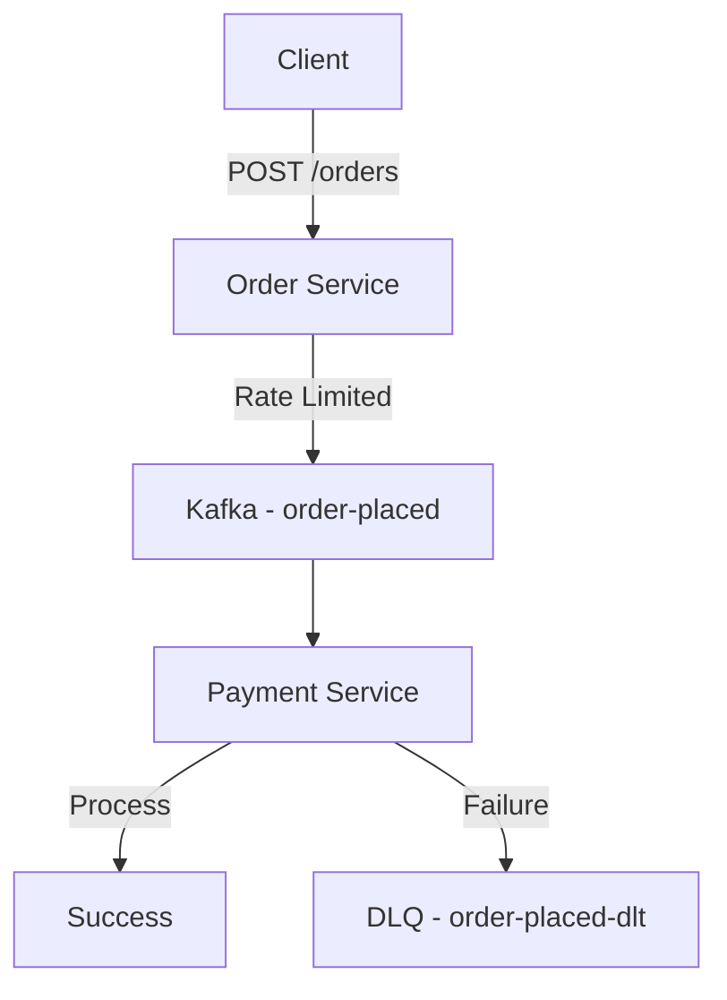

# Event-Driven Order Processing System

A distributed microservices demo built with Spring boot and Kafka, demonstrating event driven architecture and resilience.

## Architecture



## Features
- Order Service - REST API with Token Bucket rate limiting
- Payment Service - Consumes events with idempotency check
- Kafka integration - Proper JSON serialization/deserialization
- Resilience Patterns:
  - Idempotency (prevents duplicate processing)
  - Retry mechanism
  - Dead Letter Queue (DLQ) for failed messages
- Observability - Basic stats endpoint
- Containerized - Docker + Docker compose setup

## How to run
### Option 1: Docker Compose (Recommended)
```
git clone https://github.com/pillaisamarth/orchestrator.git
cd orchestrator
docker-compose up --build -d
```

### Option 2: Without Docker
1. Start Kafka locally
2. Run Order Service: 
```
cd simple-kafka-order
./mvnw spring-boot:run
```
3. Run Payment Service:
```
cd pmt-svc
./mvnw spring-boot:run
```

## API Endpoints
- Submit order
```shell
curl -X POST http://localhost:8080/orders -H "Content-Type: application/json" -d '{"userId":"user123", "amount":1000.0}'
```
- Get number of successful orders
```shell
curl -X GET http://localhost:8082/stats/success -H "Content-Type: application/json"
```
- Get total number of orders received
```shell
curl -X GET http://localhost:8082/stats/received -H "Content-Type: application/json"
```
- Get number of orders sent to dead letter topic
```shell
curl -X GET http://localhost:8082/stats/dlt -H "Content-Type: application/json"
```

## Topics
- Asynchronous communication using Kafka
- Rate Limiting (Token Bucket algorithm)
- Idempotency to handle duplicate events
- Error handling & Retries
- Dead Letter queue pattern for failed messages
- Consumer Groups and concurrency control
- JSON Serialization

## Observability and Error handling
- Metrics: Tracks received, processed, failed and duplicate orders
- Use RetryListeners to `received` metric is incremented once for each record.

Retry attempts are properly handled in retry listener so that the `received` count reflects genuine new
messages rather than redeliveries. This gives more accurate visibility into the actual load on the system.

## Redis Usage
- We use redis as a cache (since we evict entries after 24H) to check for duplicate order ids.
- We also use redis to store the token bucket state for rate limiting, which allows us to maintain a distributed state across multiple instance of application.
- Note: We're yet to make the redis operations atomic for rate limiting.

## Tradeoffs
- Chose at-least-once delivery with idempotency over exactly once
- ~~Rate limiting and idempotency are currently in-memory for demo purpose. These would be moved to Redis for distributed state across multiple instances~~
- Update : Redis is now used for rate limiting and idempotency to support distributed instances.

## Stack
- Spring Boot + Java
- Apache Kafka
- Redis (for rate limiting and idempotency)
- Docker + Docker compose
- Maven


## TODO
- Avoid in memory metrics to support distributed instances